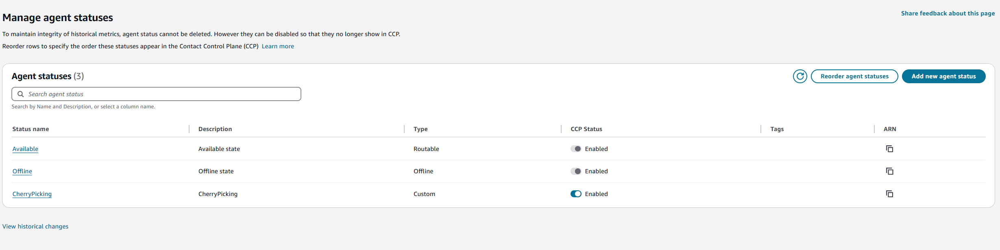

# AmazonConnect-VoiceCherryPicking
Amazon Connect - Live call view with Cherry Picking

This project enables real-time queue monitoring and contact cherry-picking in Amazon Connect, using Lambda functions, a DynamoDB table, EventBridge rule, and an API Gateway. It features automatic refreshing, contact filtering, and cherry-picking capabilities for agents. 


When a contact enters Amazon Connect, a Lambda function retrieves the contact information and stores it in a DynamoDB table. The API periodically fetches this information and displays it on a page for agents’ visibility. When a contact is picked up and dropped from the queue, an EventBridge rule triggers a Lambda function to delete that contact from the DynamoDB table. Additionally, when an agent requests to cherry-pick a call, the API updates the contact’s attributes to indicate that it has been cherry-picked, and the contact is transferred to the agent’s queue who cherry-picked it.

 
## Components

### DynamoDB Table

- **Name:** `connect-live-queue-view`
- **Keys:** `ContactID` (String)

### Lambda Functions (Python 3.9)

- **`CreateRecords`:** Initializes contact records.
- **`UpdateAgentName`:** Updates agent assignment.
- **`UpdateQueueName`:** Updates queue details.
- **`DeleteDisconnectedCall`:** Cleans up completed contacts.
- **`PopulateWebPage`:** Retrieves queue data.
- **`UpdateContactCherryPicked`:** Manages cherry-pick requests.
- **`GetAgentInfo`:** Fetches agent information.

### API Gateway

- **Endpoint:** `{api-gateway-url}/prod/queue`
- Methods: GET, POST
- CORS enabled

### Project Structure

1. **amazon-connect-flows:** Example flows for Amazon Connect.
2. **live-queue-dashboard:** Dashboard code.
3. **templates:** CloudFormation templates for AWS resources.

## Prerequisites

- AWS Account
- Amazon Connect Instance
- Node.js 14+
- Git

## Setup Process

1. **Clone the Repository:**

   ```bash
   git clone https://github.com/your-repo/AmazonConect-VoiceCherryPicking.git
   ```

2. **Deploy AWS Resources:**

   Use `api.yaml` in the `templates` folder via CloudFormation. Provide Amazon Connect Instance ID and access URL as parameters.

3. **Configure the Dashboard:**

   - Copy the API URL from CloudFormation output.
   - Update `live-queue-dashboard/src/index.js` with `const API_URL = 'your-api-url'`.

4. **Deploy the Dashboard:**
   The dashboard is a vanilla JavaScript application built with Webpack, and it can be deployed to any deployment service of your choice

   **To deploy to AWS Amplify:**

   ```bash
   cd live-queue-dashboard # Navigates into a dashboard repo
   npm install
   npm run build
   npm run prepare-build # Prepares webpack buid
   npm run create-zip # Creates the dist.zip folder with optimized build code - Command for MAC / Linux
   npm run create-7zip # Creates dist.zip folder with optimized build code - Command for windows users. (Must have 7 zip installed and added as a PATH variable, video tutorial: https://www.youtube.com/watch?v=qdfjWpeJDnw )
   ```

   - In AWS Amplify, create a new app and upload `build.zip`.

   

5. **Integrate with Amazon Connect:**

   - **Lambda Functions:** Ensure Lambda functions `CreateRecords`,`UpdateAgentName`,`UpdateQueueName`,`GetAgentInfo` [are added into connect instance](https://docs.aws.amazon.com/connect/latest/adminguide/connect-lambda-functions.html) and accessible in Connect flows.
   - **Flows:** Import example flows from `amazon-connect-flows`. (Default agent whisper - type Agent whisper | Live-Queue-Customer-Flow-Example - type Custmer queue flow | Main-Flow-Example - type Inbound flow)
   - **Third-party App:** Add the dashboard URL from step 4 to your Amazon Connect [third-party application](https://docs.aws.amazon.com/connect/latest/adminguide/onboard-3p-apps.html).
   - **Security Profile:** Enable access for the application in security profiles as shown below.

   

6. **Test the System:**

- Connect the main flow (Main-Flow-Example) to a phone number and verify Lambda CreateRecords is available.
- Open the customer flow (Live-Queue-Customer-Flow) and verify all lambdas are accessible. If the lambda blocks have errors, reselect the lambdas and publish the flow again.
- In the agent workspace app, open the live queue dashboard.
- Place a call and verify call visibility and cherry-pick functionality on the dashboard.
- Ensure that calls disappear from the dashboard once they are disconnected.

## Production Considerations and Improvements

In production environments, customers typically hear different messages and music while waiting in the queue for their call to be picked up. To ensure this solution works effectively, it is recommended to trim the music to at least five seconds and carefully check if a contact has been cherry-picked after each music or message block. This approach ensures that when an agent picks up the call, it is transferred to their queue without any delay. Below is an example of how this can be set up. This examples just uses 5 secodns of the customerqueue/wav and is not a production example of how you should handle the audio in the queue. This will need special consideration when using in production.


## Cleanup

1. **Remove AWS Resources:**

   - Delete the CloudFormation stack to remove associated resources.
 
2. **Delete Amplify App:**

   - Navigate to AWS Amplify and delete the deployed app.

3. **Clean Up Amazon Connect:**

   - Remove imported flows and third-party applications from Amazon Connect.


## UPDATE 5/6/2025  - OPTIONAL Status Management

With this solution there is a delay in the cherry picking check. This means a user, if available, could get a call from a queue when expecting a cherry picked call.
You can work around this by placing yourself in a custom status, then changing to available 5 seconds after cherry picking, but this is a manual and repetitive task.
This section will walk you through adding a custom status and Updating the **UpdateContactCherryPicked** lambda to perfrm some status management.

1. Create a new *CherryPicking* Status
- In the Amazon Connect Admin portal Navigate to *Users* and then *Agent status*
- Click *Add new agent status* and give the status a Name and Description and click *Save*
- Make sure the status is CCP enabled  
- Now click on the new status you created and copy the Status ID and save it for later   
- Repeat th abov steps the Available Status ID and save it for later use as wel 
- Now open the AWS console and navigate to the **Lambda** service
- Locate the *UpdateContactCherryPicked* Lambda and navigate to *Configuration* and then *Enviroment variables*
- Add 2 new variables **AVAIL_ID** and **STATUS_ID** and set there values that your saved above  
- Now go back to the *Code* section of the lambda and copy and paste in the [Updated Lambda logic](Optional Status Handling/UpdateContactCherryPick - Update with Status Handling Lambda.txt)
- Now publish the Lambda and you are ready to test.

  This logic will now place you in the new status (CherryPicking for this scenario) for 4.1 seconds then move you to available.  If you are already in the custom (CherryPicking) status it will just move you availble after 4.1 seconds when you cherry pick a call.
